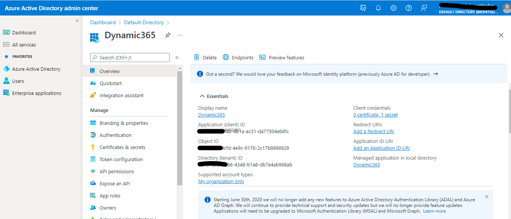

# How Azure Functions can connect with Dynamic 365

### Create Dynamic 365 Trials

Create Dynamic 365 Trials using custome domain only . Refer [Link](https://dynamics.microsoft.com/en-us/sales/overview/)


### Login to Admin Center to create App Registration 

Create Service Principal in Azure Active Directory . 

Login into [Power Platform Admin center](https://admin.powerplatform.microsoft.com/environments)


Create Application in App Registration . use these Client_id , Client_Secret while connecting to Dynamic 365 using Azure Functions



Give Access to app as system admin permission 


### Create Azure Fucntion 

use below code to connect Dynamic 365 

```
var connectionString = $"Url=https://{Instance}.dynamics.com;AuthType=ClientSecret;ClientId={ClientId};ClientSecret={ClientSecret};RequireNewInstance=true";
var serviceClient = new Microsoft.PowerPlatform.Dataverse.Client.ServiceClient(connectionString);


Entity entity = new Entity("account");

entity["name"] = "Created By Azure";
entity["accountid"] = Guid.NewGuid().ToString();
serviceClient.Create(entity);

```
